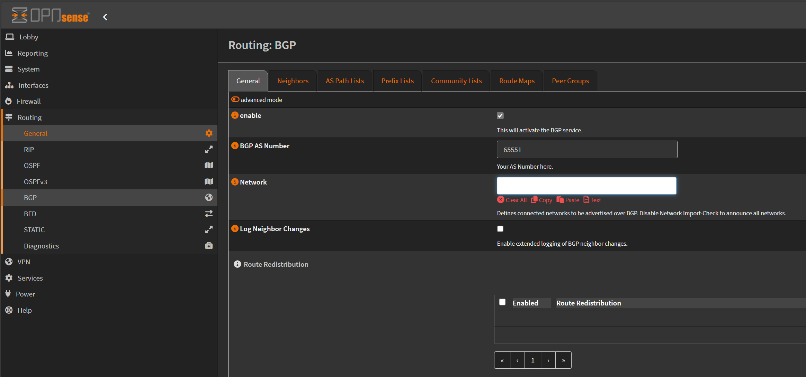
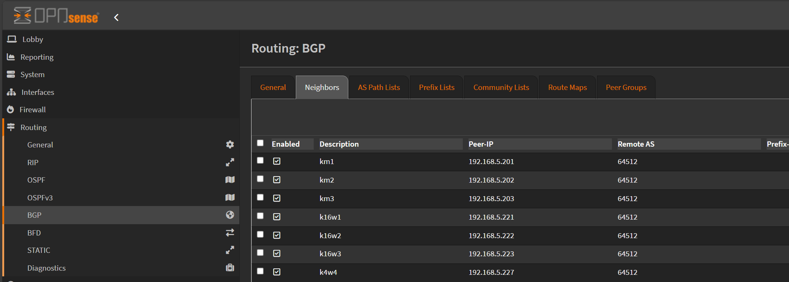
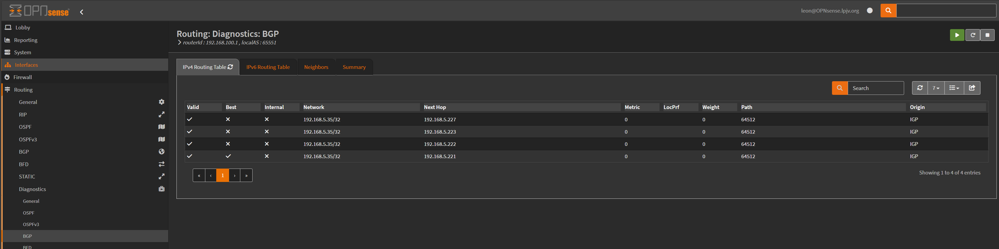
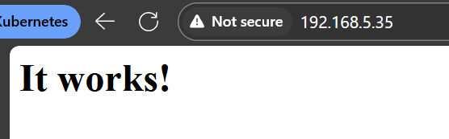

# Steps

## Checks before installing metallb
according to the [metallb documentation](https://metallb.universe.tf/installation/), we should check if kubeproxy is used in ipvs mode. To check this, run the following command:
```bash
kubectl -n kube-system get pods | grep kube-proxy
```
Then check the logs of any kube-proxy pod:
```bash
kubectl -n kube-system logs -f kube-proxy-<pod-name>
```


Look for ipvs, iptables, or userspace mode in the logs. If you see ipvs, you need to enable strict arp mode. If you see iptables, you need to enable arp mode. 

```bash
kubectl edit configmap -n kube-system kube-proxy-<pod-name>
```

and set:
```yaml
apiVersion: kubeproxy.config.k8s.io/v1alpha1
kind: KubeProxyConfiguration
mode: "ipvs"
ipvs:
  strictARP: true
```

## Install metallb

1. `helm repo add metallb https://metallb.github.io/metallb`
2. `helm install metallb metallb/metallb -f values.yaml`

## Configure metallb

Add an ip address pool to metallb. This is the address range that metallb will use to assign IP addresses to services. The address range should be in the same subnet as the nodes in the cluster. **Also make sure you adjust the DHCP range in your router to avoid conflicts with the IP addresses assigned by metallb.**

```shell
kubectl apply -f metallb-config.yaml
```

## Check metallb
Check if metallb is running:
```bash
kubectl get pods
```

## Finally advertise the IP pool


### Option 1  - Layer 2 advertisement
l2 advertisement is used for layer 2 networks. This means that metallb will use ARP to advertise the IP addresses in the pool to the network. This is the most common mode of operation for metallb.

Easy but only uses a single node. 

```bash
kubectl apply -f metallb-advert.yaml
```


### Option 2 - BGP advertisement (in use currently and preferred if your router supports it)

First, make sure your router supports BGP. I am using opnsense which supports BGP via the os-frr plugin.

Install the os-frr plugin. Configure the BGP settings as follows:







note that for each node in the cluster, you need to add a peer. The peer should be the IP address of the node in the cluster. 

if you forget the node ips:
```bash
kubectl get nodes -o wide
```


Once the router is configured, you can configure metallb to use BGP. 

```bash
kubectl apply -f metallb-advert-bgp.yaml
```

The manifest has comments to explain the configuration.

Worth also checking the diagnostics in opnsense to see if the BGP peers were established. Needed to restart the BGP daemon/service (idk) in opnsense to get it to work.




# test

```bash
kubectl apply -f test_app.yaml
```

to confirm the service external ip:
```bash
kubectl get svc -A
```

open the external ip in a browser. You should see the nginx welcome page. 


