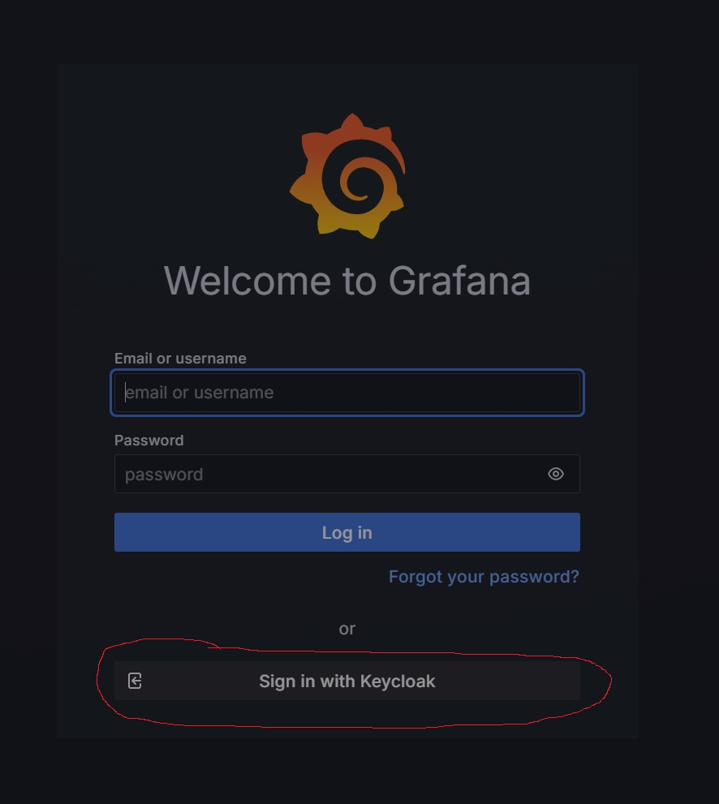

# Pre-installation

## Create the Keycloak oauth client

[Grafana docs](https://grafana.com/docs/grafana/latest/setup-grafana/configure-security/configure-authentication/keycloak/#keycloak-configuration)

Create some groups in Keycloak/Azure which you will map to Grafana roles:

- GrafanaAdmin
- GrafanaEditor
- GrafanaViewer

Add your user to these groups.

## create the namespace

```bash
kubectl create namespace observability
```


## Secrets

1. keycloak secrets
```yaml
apiVersion: v1
kind: Secret
metadata:
  name: grafana-keycloak-secret
  namespace: observability  # or your grafana namespace
type: Opaque
stringData:
  GF_AUTH_GENERIC_OAUTH_CLIENT_ID: grafana-oauth  # Name of the OAuth client in Keycloak/azure
  GF_AUTH_GENERIC_OAUTH_CLIENT_SECRET: <your-client-secret> # Replace with your actual client secret
```
2. admin user secret

```yaml
apiVersion: v1
kind: Secret
metadata:
  name: grafana-admin-secret
  namespace: observability  # or your grafana namespace
type: Opaque
stringData:
  admin-user: <your-admin-user>  # Replace with your actual admin user
  admin-password: <your-admin-password>  # Replace with your actual admin password
```

```bash
kubectl apply -f grafana-keycloak-secret.yaml
kubectl apply -f grafana-admin-secret.yaml
```

# create the httproute for grafana

```bash
kubectl apply -f httproute/grafana.yaml
```

# Installation

## Update the values.yaml file

change to your domain name etc

```yaml
# ...existing code...
  auth.generic_oauth:
    enabled: true
    name: Keycloak
    allow_sign_up: true
    client_id: ${GF_AUTH_GENERIC_OAUTH_CLIENT_ID}
    client_secret: ${GF_AUTH_GENERIC_OAUTH_CLIENT_SECRET}
    scopes: openid email profile offline_access roles groups
    email_attribute_path: email
    login_attribute_path: preferred_username
    name_attribute_path: name
    groups_attribute_path: groups
    auth_url: https://keycloak.mydomain.com/realms/master/protocol/openid-connect/auth
    token_url: https://keycloak.mydomain.com/realms/master/protocol/openid-connect/token
    api_url: https://keycloak.mydomain.com/realms/master/protocol/openid-connect/userinfo
    # Map Keycloak groups to Grafana roles
    role_attribute_path: "
    allow_assign_grafana_admin: true
    skip_org_role_sync: false
```

## Install Grafana with Helm

```bash
helm upgrade --install grafana grafana/grafana -n observability --values values-secret.yaml
```


# Check the installation


