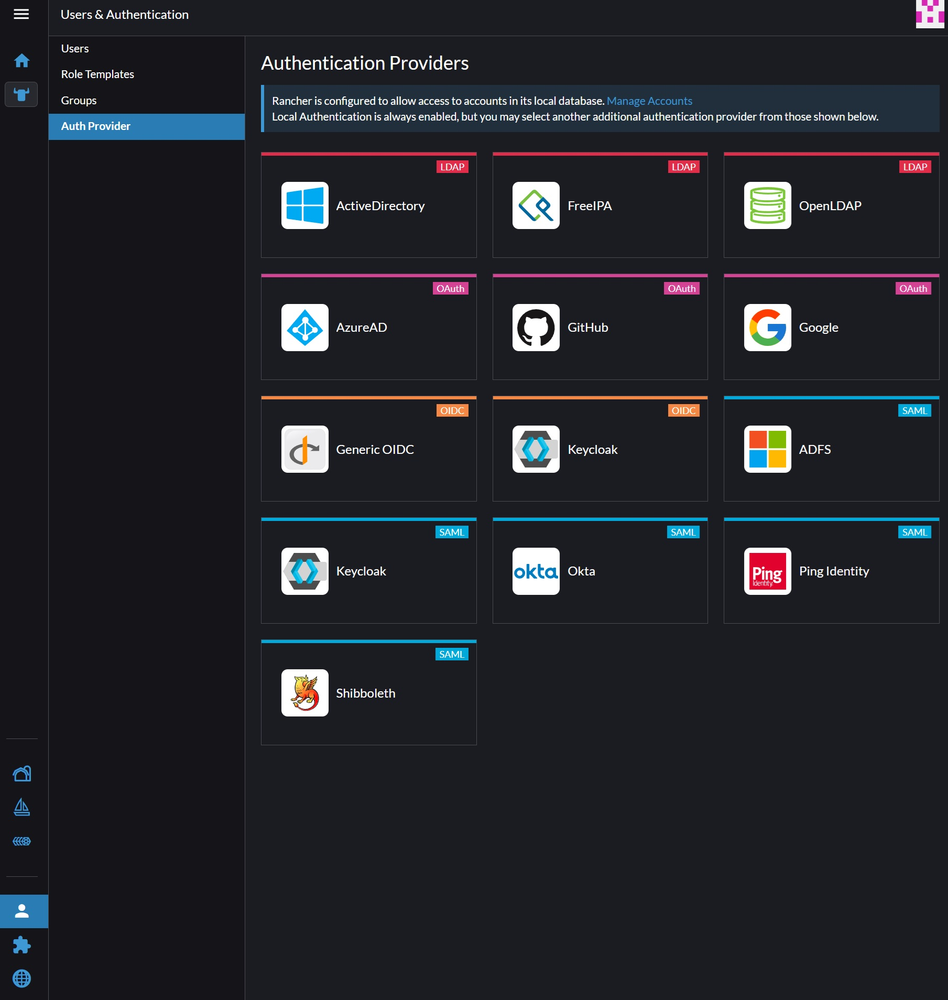

# Rancher install

## Add the repo

```shell
helm repo add rancher-stable https://releases.rancher.com/server-charts/stable
```

## Create the namespace

```shell
kubectl create namespace cattle-system
```

## Install Rancher

Reminder to update the hostname in the `values-secret.yaml` file. The values.yaml has been provided as a reference, just update the `hostname` field in the `values-secret.yaml` file.


```shell
helm upgrade --install rancher rancher-stable/rancher --namespa
ce cattle-system --values values-secret.yaml
```


# Set up an auth provider in the UI

