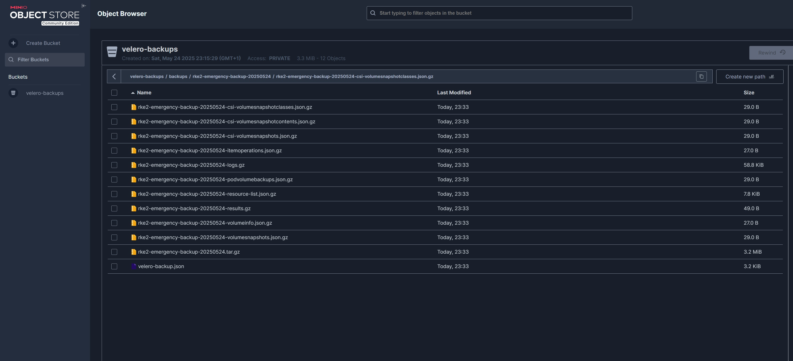

# Velero

Velero is a tool for managing backups and disaster recovery for Kubernetes clusters. 

## Install Velero command line tool
To install Velero, you can use the following command:

as of documentation date, the latest version is 1.16.1
```bash
curl -fsSL -o velero.tar.gz https://github.com/vmware-tanzu/velero/releases/download/v1.16.1/velero-v1.16.1-linux-amd64.tar.gz
tar -xvf velero.tar.gz
sudo mv velero-v1.16.1-linux-amd64/velero /usr/local/bin/
```

## Set up resources for Velero

We will use MinIO as the object storage (s3) for Velero backups. The following steps will set up the necessary resources in your Kubernetes cluster.

1. Create a namespace for Velero:
```bash
kubectl apply -f velero-namespace.yaml
```
2. Create a secret for minio credentials:

```bash
kubectl apply -f minio-credentials-secret.yaml
```

3. Deploy the minio resources.

```bash
kubectl apply -f minio.yaml
```

Note: I make use of a secret for the MinIO credentials. The secret is created in the `velero` namespace and contains the access key and secret key for MinIO.

```yaml
# minio-credentials-secret.yaml
apiVersion: v1
kind: Secret
metadata:
  name: minio-credentials
  namespace: velero
type: Opaque
stringData:
  user: minio
  password: minio123
```

4. Deploy the Velero resources.

```bash
velero install --provider aws --plugins velero/velero-plugin-for-aws:v1.12.1 --bucket velero-backups --use-node-agent --backup-location-config region=default,s3ForcePathStyle="true",s3Url=http://minio.velero.svc.cluster.local:9000 --secret-file ./minio-secrets
```

Note: ./minio-secrets is the path to the file containing the MinIO credentials in the format expected by Velero.
```ini
[default]
aws_access_key_id = minio
aws_secret_access_key = minio123
```

Checks:

```shell
# Check Velero components
kubectl get all -n velero

# Verify backup location
velero backup-location get
```

5. Schedule backups 

This is a weekly backup schedule that excludes persistent volumes and persistent volume claims, and has a time to live (TTL) of 30 weeks. It runs at 2 AM every Sunday(day 0 of the week).

```bash
velero schedule create weekly-rke2-config --schedule="0 2 * * 0" --exclude-resources persistentvolumes,persistentvolumeclaims --ttl 5040h
```

Verify the schedule
```bash
velero schedule get
```
Verify the backup
```bash
velero backup get
```

6. Emergency backup

To create an emergency backup, you can use the following command:

```bash
velero backup create rke2-emergency-backup-$(date +%Y%m%d) --exclude-resources persistentvolumes,persistentvolumeclaims
```

Verify the emergency backup
```bash
velero backup get
```

7. Restore from backup
To restore from a backup, you can use the following command:

```bash
# Restore the emergency backup
velero restore create restore-rke2-emergency-20250524 --from-backup rke2-emergency-backup-20250524

# Monitor the restore progress
velero restore describe restore-rke2-emergency-20250524

# Check restore status
velero restore get
```

# Viewing backups and restores

I created a httproute to expose the minio-console service, which allows you to view the backups and restores in a web interface. 

```yaml
# minio-console-httproute.yaml
apiVersion: gateway.networking.k8s.io/v1
kind: HTTPRoute
metadata:
  name: minio-httproute  # Replace with your desired name
  namespace: velero
spec:
  parentRefs:
    - name: mydomain-istio-gw  # Replace with your gateway name
      namespace: default  # dont forget this
      sectionName: web
  hostnames:
    - "minio.mydomain.com" # Replace with your domain
  rules:
    - filters:
        - type: RequestRedirect
          requestRedirect:
            scheme: https
---
apiVersion: gateway.networking.k8s.io/v1
kind: HTTPRoute
metadata:
  name: minio-httpsroute
  namespace: velero
spec:
  parentRefs:
    - name: mydomain-istio-gw  # Replace with your gateway name
      namespace: default  # dont forget this
      sectionName: websecure
  hostnames:
    - "minio.mydomain.com" # Replace with your domain
  rules:
    - matches:
        - path:
            type: PathPrefix
            value: /
      backendRefs:
        - name: minio-console  # Replace with your service name - `kubectl get svc -n minio`
          namespace: velero
          port: 9001  # Changed from 8443 to 8080 (HTTP port)
```

You can see the backups and restores in the MinIO console at `https://minio.mydomain.com`.

